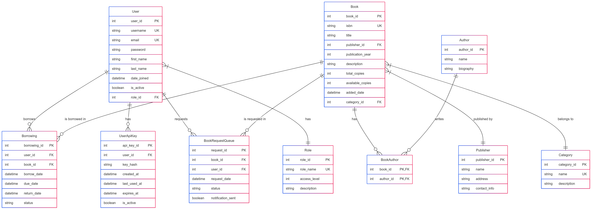

# Library Management System

A comprehensive Library Management System built with FastAPI, offering an efficient solution for libraries to manage their book collection, user accounts, and borrowing processes.

## Features

### Core Features
- **Book Management**: Add, update, delete, and search books (librarian-only access)
- **User Management**: Authentication and role-based authorization (librarian vs. regular user)
- **Borrowing System**: Borrow and return books with availability checks
- **History Tracking**: View user borrowing history and book statuses

### Security Features
- **JWT Authentication**: Secure token-based authentication system
- **API Key Support**: Alternative authentication using API keys
- **Password Hashing**: Secure password storage with bcrypt
- **Rate Limiting**: Redis-backed rate limiting to prevent API abuse
- **Role-based Access Control**: Different permissions for librarians and regular users

### Bonus Features
- **OpenAPI Documentation**: Interactive API testing with Swagger UI
- **Redis Caching**: High-performance caching for frequently accessed data
- **WebSocket Notifications**: Real-time notifications for book availability
- **Comprehensive Logging**: Detailed logging for monitoring and debugging

## Tech Stack

- **Backend**: FastAPI
- **Database**: PostgreSQL with SQLAlchemy ORM
- **Migrations**: Alembic
- **Authentication**: JWT + API Keys
- **Caching & Rate Limiting**: Redis
- **Real-time Communication**: WebSockets
- **Documentation**: OpenAPI/Swagger
- **Containerization**: Docker support

## Docker Deployment

### Option 1: Using Docker Compose (Recommended)

The easiest way to run the application is using Docker Compose, which will set up all required services:

1. **Clone the repository and navigate to the project directory**
   ```bash
   git clone https://github.com/saifalikhan-98/library_management.git
   cd library-management
   ```

2. **Start the application**
   ```bash
   docker-compose up -d
   ```

   This will:
   - Build the application image
   - Start PostgreSQL and Redis
   - Run database migrations automatically
   - Start the FastAPI application

3. **Access the application**
   - API: http://localhost:8000
   - Swagger Documentation: http://localhost:8000/docs

4. **Stop the application**
   ```bash
   docker-compose down
   ```

### Option 2: Pull and Run the Pre-built Docker Image

You can also use the pre-built Docker image from Docker Hub:

```bash
docker pull yourusername/library-management:latest

docker run -d \
  -p 8000:8000 \
  --name library-api \
  -e DATABASE_URL= \
  -e REDIS_HOST= \
  -e REDIS_PORT= \
  -e SECRET_KEY= \
  -e ACCESS_TOKEN_EXPIRE_MINUTES= \
  -e ADMIN_INITIAL_PASSWORD= \
  -e ADMIN_EMAIL= \
  -e ADMIN_USERNAME= \
  -e ALGORITHM= \
  -e POSTGRES_USER= \
  -e POSTGRES_PASSWORD= \
  -e POSTGRES_DB= \
  yourusername/library-management:latest
```

Note: You'll need to set up PostgreSQL and Redis separately when using this method.

### Building and Publishing Your Docker Image

If you want to build and publish your own Docker image for others to use, follow these steps:

1. **Login to Docker Hub**
   ```bash
   docker login
   ```

2. **Build your Docker image**
   ```bash
   docker build -t library-management-system:latest .
   ```

3. **Tag your image**
   ```bash
   docker tag library-management-system:latest yourusername/library-management-system:latest
   ```

4. **Push your image to Docker Hub**
   ```bash
   docker push saifalikhan98/library-management-system:latest
   ```

For more detailed instructions on building and publishing Docker images, see the [Docker Image Build and Upload Instructions](./DOCKER.md) file.

## API Documentation

For comprehensive API documentation, please refer to:

1. **Swagger UI Documentation**: Available at http://localhost:8000/docs after starting the application
2. **OpenAPI JSON File**: Refer to the `api_documentation.json` file included in the repository

The API includes endpoints for:
- User authentication and registration
- Book management (add, update, delete)
- Book borrowing and returns
- User history and profile management
- WebSocket notifications for real-time updates

### WebSocket Notifications

Connect to:
```
WS /ws/notifications?token={jwt_token}
```

## Database Schema

The system uses a normalized relational database schema with the following structure:



### Core Tables

- **users**: User accounts with authentication details and personal information
  - Primary fields: user_id, username, email, password, first_name, last_name, is_active
  - Relationships: Role (many-to-one), Borrowings (one-to-many), UserApiKeys (one-to-many)

- **roles**: User roles and permissions
  - Primary fields: role_id, role_name, access_level, description
  - Access levels: 3=Admin, 2=Librarian, 1=Regular User

- **books**: Book details and metadata
  - Primary fields: book_id, isbn, title, publication_year, description, total_copies, available_copies
  - Relationships: Publisher (many-to-one), Category (many-to-one), Authors (many-to-many)

- **authors**: Author information
  - Primary fields: author_id, name, biography
  - Relationships: Books (many-to-many via book_authors)

- **publishers**: Publisher information
  - Primary fields: publisher_id, name, address, contact_info
  - Relationships: Books (one-to-many)

- **categories**: Book categories/genres
  - Primary fields: category_id, name, description
  - Relationships: Books (one-to-many)

### Join Tables

- **book_authors**: Many-to-many mapping between books and authors
  - Primary fields: book_id, author_id

### Transaction Tables

- **borrowings**: Borrowing records and history
  - Primary fields: borrowing_id, user_id, book_id, borrow_date, due_date, return_date, status
  - Status values: 'borrowed', 'returned', 'overdue'

- **book_request_queue**: Queue for book availability notifications
  - Primary fields: request_id, book_id, user_id, request_date, status, notification_sent
  - Status values: 'PENDING', 'FULFILLED', 'CANCELLED'

### Authentication Tables

- **user_keys**: User API keys for alternative authentication
  - Primary fields: api_key_id, user_id, key_hash, created_at, expires_at, is_active

## Rate Limiting

The API implements a two-tier rate limiting strategy:

1. **Global Rate Limiting**: Limits overall requests to prevent abuse
2. **Endpoint-Specific Rate Limiting**: Different limits for different operations

## Error Handling

The API provides clear error responses with appropriate HTTP status codes:

- **400**: Bad Request - Invalid input
- **401**: Unauthorized - Authentication required
- **403**: Forbidden - Insufficient permissions
- **404**: Not Found - Resource doesn't exist
- **409**: Conflict - Resource state conflict (e.g., already borrowed)
- **429**: Too Many Requests - Rate limit exceeded
- **500**: Internal Server Error - Unexpected error
